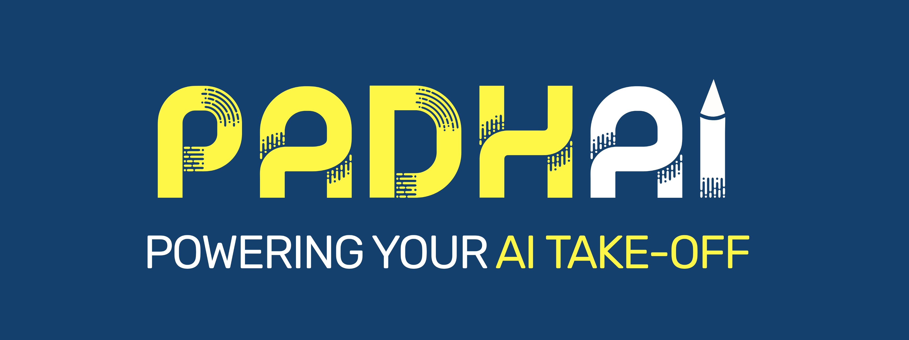

# **PadhAI: Deep Learning Course**

This repository contains the theoretical summary of concepts and practical implementation of the topics covered in the course I did on **Deep Learning** from [**PadhAI - One Fourth Labs**](https://padhai.onefourthlabs.in/courses/dl-feb-2019) taught by IIT Madras faculty.

## Course Instructors:

- [**Mitesh Khapra**](https://www.cse.iitm.ac.in/~miteshk/)
- [**Pratyush Kumar**](http://www.cse.iitm.ac.in/~pratyush/)

## Completion Certificate

- [Deep Learning Certificate](Images/DL-PadhAI.pdf)

### Overview of Lab Session Modules with Python:

[**M1**](Notebooks/Python_I): **Python Basics I** - Data Types, Lists, Tuple, Set, Dictionary, Packages, File Handling, Class, Numpy, Plotting.

[**M2**](https://prvnk10.medium.com/expert-systems-37b9fc4f6351): **Expert Systems** - Introduction, Why do we care about Binary Classification?, How do humans make decisions?, Limitations.

[**M3**](https://prvnk10.medium.com/say-hi-to-machine-learning-5408e21dd9d7): **Say Hi to Machine Learning** - 6 Jars of Machine Learning: Data, Task, Model, Loss, Learning Algorithm, Evaluation.

[**M4**](https://prvnk10.medium.com/vectors-and-matrices-2e6da387fa9f): **Vectors and Matrices** - Introduction to Vectors, Dot product of vectors, Unit Vectors, Projection of one vector onto another, Angle between two vectors, Why do we care about vectors?, Introduction to Matrices, Multiplying a vector by a matrix, Multiplying a matrix by another matrix, An alternate way of multiplying two matrices, Why do we care about matrices?

[**M5**](Notebooks/Python_II): **Python Basics II** - Linear Algebra, Pandas, Python Debugger, Plotting Vectors, Vector Addition and Subtraction, Vector Dot Product.

[**M6**](https://prvnk10.medium.com/mcculloch-pitts-mp-neuron-c4dabf3e0a4): **McCulloch Pitts(MP) Neuron** - Introduction, MP Neuron Model, MP Neuron Data Task, MP Neuron Loss, MP Neuron Learning, MP Neuron Evaluation, MP Neuron Geometry Basics, MP Neuron Geometric Interpretation.

[**M7**](https://prvnk10.medium.com/perceptron-model-562590bbbc82): **Perceptron** - Introduction, Perceptron Data Task, Perceptron Model, Geometric Interpretation, Perceptron Loss Function, Perceptron Learning - General Recipe, Algorithm, Why It Works?, Will It Always Work?, Perceptron Evaluation, Summary.

[**M8**](Notebooks/Python_III): **Python: MP Neuron, Perceptron, Test/Train** - Perceptron: Toy Example, Loading Data, Train-Test Split, Binarisation, Inference And Search, Inference, Class, Perceptron Class, Epochs, Checkpointing, Learning Rate, Weight Animation, Excercises.

[**M9**](Notebooks/Contests): **Contest 1.1** - Contests Intro, Creating a Kaggle account, Data preprocessing, Submitting Entries, Clarifications, Mobile phone like/dislike predictor

[**M10**](https://prvnk10.medium.com/sigmoid-neuron-ad0ec6f9a3e2), [**M11**](https://prvnk10.medium.com/sigmoid-neuron-part-2-2b2845a27948), [**M12**](https://prvnk10.medium.com/mathematics-behind-the-parameters-update-rule-d16f0f722b0a): **Sigmoid Neuron and Gradient Descent** - Sigmoid Model (Part - I, II, III, IV), **Sigmoid**: Data and Tasks, Loss Function, Dealing with more than 2 parameters, Evaluation. **Learning**: Introduction to learning algorithm, Learning by guessing, Error surfaces for learning, Mathematical setup for the learning algorithm, Math free version of learning algorithm, Taylor Series, Deriving the gradient descent update rule, The complete learning algorithm, Computing partial derivatives, Writing the code. **Mathematics behind the parameters update rule.** Summary and Takeaways.

[**M13**](Notebooks/Python_IV): **Python: Sigmoid, Gradient Descent** - Plotting Sigmoid 2D & 3D, Plotting Loss, Contour Plot, Class, Toy Data Fit and Plot. Loading Data, Standardisation, Test/Train Split, Fitting Data, Loss Plot, Progress Bar, Exercises.

[**M14**](https://medium.com/@prvnk10/basics-probability-theory-e90e1e9d2c00): **Basics: Probability Theory** - Introduction, Random Variable: Intuition, Formal Definition, Continuous and Discrete, Probability Distribution, True and Predicted Distribution, Certain Events, Why Do we Care About Distributions?

[**M15**](https://medium.com/@prvnk10/information-theory-31d05a28ca8b): **Information Theory** - Expectation, Information Content, Entropy, Relation To Number Of Bits, KL-Divergence and Cross Entropy.

[**M16**](https://medium.com/@prvnk10/sigmoid-neuron-and-cross-entropy-962e7ad090d1): **Sigmoid Neuron and Cross Entropy** - Using Cross Entropy With Sigmoid Neuron, Learning Algorithm for Cross Entropy loss function, Computing partial derivatives with cross entropy loss, Code for Cross Entropy Loss function.
